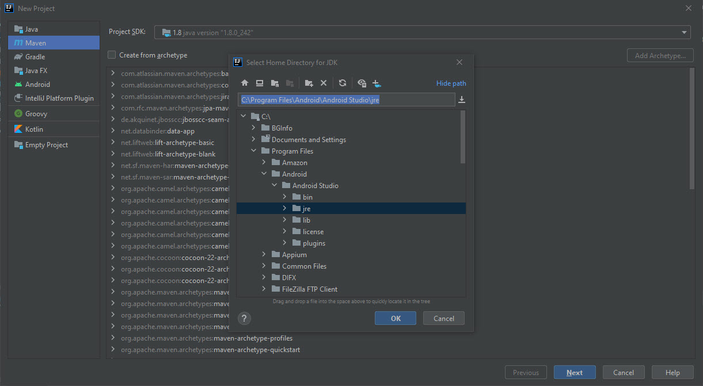
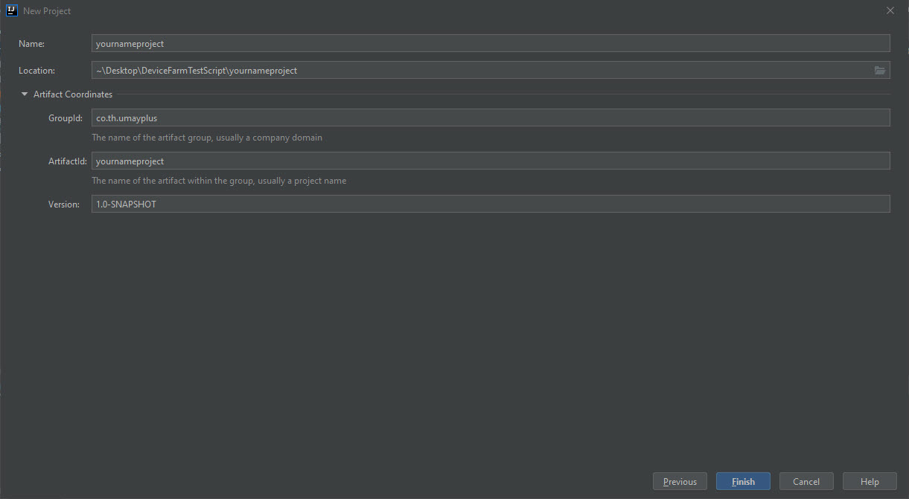
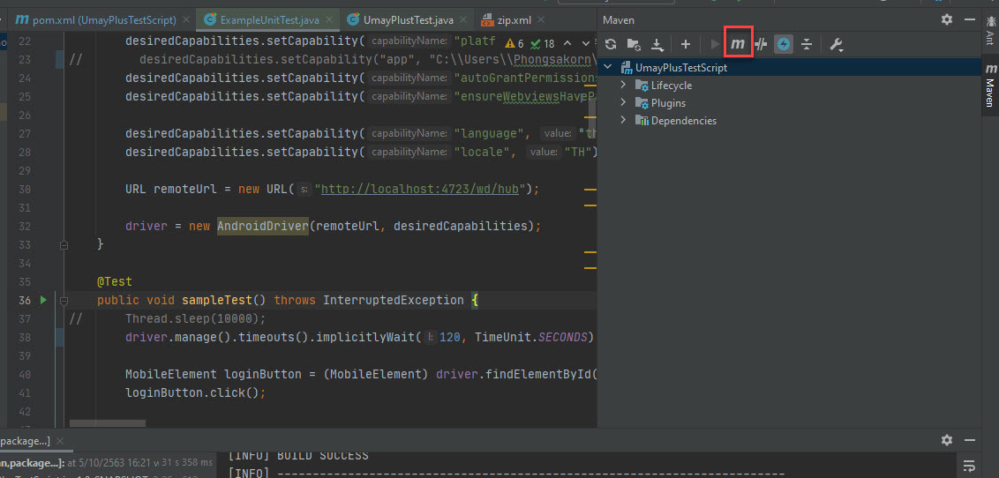

# Install Download IntelliJ IDEA

**Community**

https://www.jetbrains.com/idea/download/#section=windows


# Create Project







# Config Code in pom.xml File

Ref https://docs.aws.amazon.com/devicefarm/latest/developerguide/test-types-appium.html#test-types-appium-prepare


pom.xml

```
<?xml version="1.0" encoding="UTF-8"?>
<project xmlns="http://maven.apache.org/POM/4.0.0"
         xmlns:xsi="http://www.w3.org/2001/XMLSchema-instance"
         xsi:schemaLocation="http://maven.apache.org/POM/4.0.0 http://maven.apache.org/xsd/maven-4.0.0.xsd">
    <modelVersion>4.0.0</modelVersion>

    <groupId>th.co.umayplus</groupId>
    <artifactId>UmayPlusTestScript</artifactId>
    <version>1.0-SNAPSHOT</version>
    <!-- ADD NEW -->
    <!-- 1.Modify pom.xml to set packaging to a JAR file: -->
    <!-- https://docs.aws.amazon.com/devicefarm/latest/developerguide/test-types-appium.html#test-types-appium-prepare -->
    <packaging>jar</packaging>

    <!-- ADD NEW -->
    <dependencies>
        <!-- https://mvnrepository.com/artifact/io.appium/java-client/7.3.0 -->
        <dependency>
            <groupId>io.appium</groupId>
            <artifactId>java-client</artifactId>
            <version>7.3.0</version>
        </dependency>
        <!-- https://mvnrepository.com/artifact/junit/junit/4.13 -->
        <dependency>
            <groupId>junit</groupId>
            <artifactId>junit</artifactId>
            <version>4.13</version>
            <scope>test</scope>
        </dependency>
    </dependencies>

    <!-- ADD NEW -->
    <build>
        <plugins>
            <!-- 2.Modify pom.xml to use maven-jar-plugin to build your tests into a JAR file. -->
            <!-- https://docs.aws.amazon.com/devicefarm/latest/developerguide/test-types-appium.html#test-types-appium-prepare -->
            <plugin>
                <groupId>org.apache.maven.plugins</groupId>
                <artifactId>maven-jar-plugin</artifactId>
                <version>2.6</version>
                <executions>
                    <execution>
                        <goals>
                            <goal>test-jar</goal>
                        </goals>
                    </execution>
                </executions>
            </plugin>

            <!-- 3.Modify pom.xml to use maven-dependency-plugin to build dependencies as JAR files. -->
            <!-- https://docs.aws.amazon.com/devicefarm/latest/developerguide/test-types-appium.html#test-types-appium-prepare -->
            <plugin>
                <groupId>org.apache.maven.plugins</groupId>
                <artifactId>maven-dependency-plugin</artifactId>
                <version>2.10</version>
                <executions>
                    <execution>
                        <id>copy-dependencies</id>
                        <phase>package</phase>
                        <goals>
                            <goal>copy-dependencies</goal>
                        </goals>
                        <configuration>
                            <outputDirectory>${project.build.directory}/dependency-jars/</outputDirectory>
                        </configuration>
                    </execution>
                </executions>
            </plugin>

            <!-- 5.Modify pom.xml to use maven-assembly-plugin to package tests and all dependencies into a single .zip file. -->
            <!-- https://docs.aws.amazon.com/devicefarm/latest/developerguide/test-types-appium.html#test-types-appium-prepare -->
            <plugin>
                <artifactId>maven-assembly-plugin</artifactId>
                <version>2.5.4</version>
                <executions>
                    <execution>
                        <phase>package</phase>
                        <goals>
                            <goal>single</goal>
                        </goals>
                        <configuration>
                            <finalName>zip-with-dependencies</finalName>
                            <appendAssemblyId>false</appendAssemblyId>
                            <descriptors>
                                <descriptor>src/main/assembly/zip.xml</descriptor>
                            </descriptors>
                        </configuration>
                    </execution>
                </executions>
            </plugin>
        </plugins>
    </build>
</project>
```


# Create file zip.xml

create to **src/main/assembly/zip.xml**

zip.xml

```
<assembly
        xmlns="http://maven.apache.org/plugins/maven-assembly-plugin/assembly/1.1.0"
        xmlns:xsi="http://www.w3.org/2001/XMLSchema-instance"
        xsi:schemaLocation="http://maven.apache.org/plugins/maven-assembly-plugin/assembly/1.1.0 http://maven.apache.org/xsd/assembly-1.1.0.xsd">
    <id>zip</id>
    <formats>
        <format>zip</format>
    </formats>
    <includeBaseDirectory>false</includeBaseDirectory>
    <fileSets>
        <fileSet>
            <directory>${project.build.directory}</directory>
            <outputDirectory>./</outputDirectory>
            <includes>
                <include>*.jar</include>
            </includes>
        </fileSet>
        <fileSet>
            <directory>${project.build.directory}</directory>
            <outputDirectory>./</outputDirectory>
            <includes>
                <include>/dependency-jars/</include>
            </includes>
        </fileSet>
    </fileSets>
</assembly>
```


# Build Project




RUN : **mvn clean package -DskipTests=true**